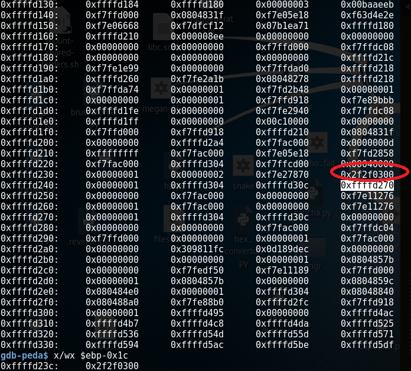
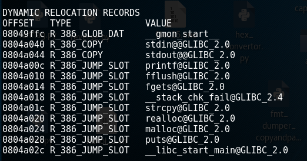

# SHA2017 Megan-35

呢題其實唔難,如果比賽個陣熟canary,根本就係coding challenge同小學生加減數問題:0)

呢條問題主要係一個input megan-35 encrypted message,output decrypted message 嘅service

有format string bug

由於佢有開canary,我地可以寫爛個canary,check sec fail同printf, 跳返去main再input /bin/sh, run system("/bin/sh")

首先用ida搵 canary address:

數到第135號位save左 canary

由於係提供所以可以利用再寫去揾搵返

Reference
==========================
1.http://veritas501.space/2017/04/28/%E8%AE%BAcanary%E7%9A%84%E5%87%A0%E7%A7%8D%E7%8E%A9%E6%B3%95/

2.https://hgarrereyn.gitbooks.io/th3g3ntl3man-ctf-writeups/content/2017/SHA2017CTF/problems/pwnable/megan-35/

3.https://b0tchsec.com/2017/sha2017/megan-35

4.https://chung96vn.blogspot.hk/2017/08/sha2017-write-up-pwn-200.html

5.https://github.com/L4ys/CTF/blob/master/sha_2017/pwn200/exp.py

