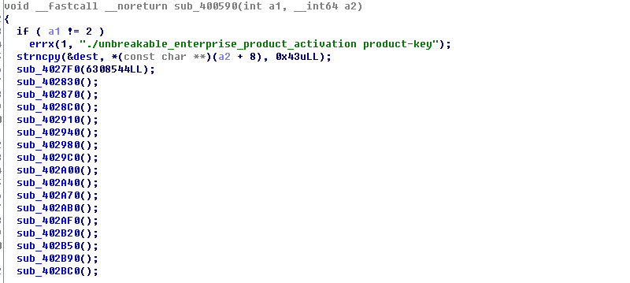

[Google CTF 2016] google2016 unbreakable 0
===============================================

呢條題目出現係/angr-dev/example

直接拎左個binary黎玩

string length=0x43





address


呢條其實唔難either z3 or angr

要注意一個點就係

```python
#By default there's only 60 symbolic bytes, which is too small for this case
#This region is tunable in case of any out bound error found
state.libc.buf_symbolic_bytes=str__len +1
#state.libc.buf_symbolic_bytes = 500
```

自己打完一次,都卡呢個位


由於pass argv係command line執行,所以要用

```python
#use claripy if is argv type passing
input_string = angr.claripy.BVS("input_string", 8 * str__len)

state = proj.factory.entry_state(args=["./unbreakable-enterprise-product-activation", input_string], add_options={simuvex.o.LAZY_SOLVES})

```


Reference
==========================
1. Script in angr-dev/example

2. [Z3 solution 1](https://p1kachu.pluggi.fr/writeup/re/2016/05/01/googlectf-unbreakable-writeup/)

3. [Z3 solution 2](http://tkmr.hatenablog.com/entry/2016/08/19/011529)

4. [angr writeup 1](http://hack.carleton.team/2016/05/05/google-ctf-2016-unbreakable-enterprise-product-activation-150-points/)

5. [angr writeup 2](http://yuanvi.cn/2016/05/01/angr-google-ctf)

6. [angr writeup 3](http://www.99cruster.com/blog/2016/05/02/google-ctf-2016-unbreakable-enterprise-product-activation-writeup-using-angr/)

