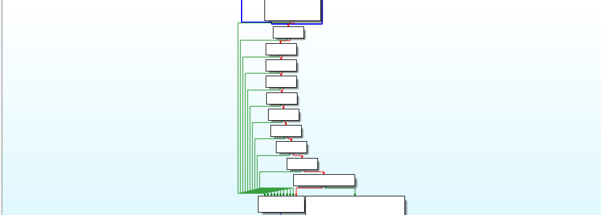
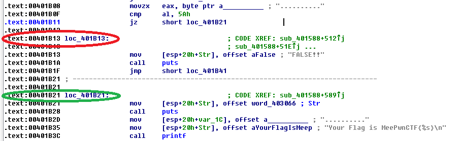
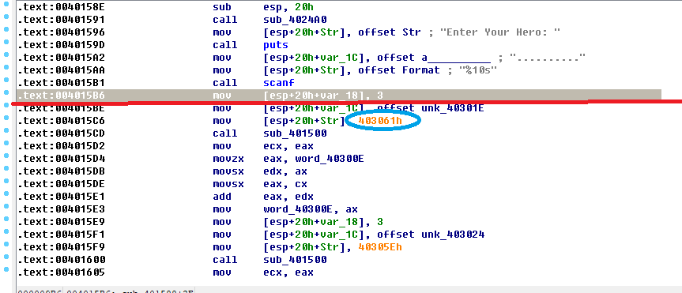
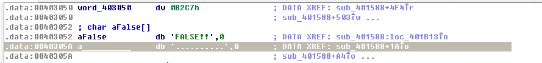

[MeePwn CTF] Missing Hash
===================
首先gen個CFG望下:



Symbolic Execution!!!

F5一下先:

```C++

int sub_401588()
{
  signed int i; // [sp+1Ch] [bp-4h]@1

  sub_4024A0();
  puts("Enter Your Hero: ");
  scanf("%10s", a__________);
  word_40300E += sub_401500(4206689, &unk_40301E, 3);
  word_403012 += sub_401500(4206686, &unk_403024, 3);
  word_403010 += sub_401500(a__________, &unk_403022, 3);
  word_403014 += sub_401500(4206685, &unk_403020, 3);
  word_403008[0] += sub_401500(4206687, &unk_403018, 3);
  word_40300C += sub_401500(4206685, &unk_40301C, 4);
  word_40300A += sub_401500(4206684, &unk_403026, 3);
  for ( i = 0; i <= 6; ++i )
    word_403008[i] = (word_403008[i] << 8) ^ (word_403008[i] >> 8);
  *(_WORD *)word_403066 += sub_401500(&unk_40302E, &word_40300C, 2);
  word_40306E += sub_401500(&unk_40302D, &word_403012, 2);
  word_403068 += sub_401500(&unk_403031, word_403008, 2);
  word_403070 += sub_401500(&unk_40302C, &word_403010, 2);
  word_403072 += sub_401500(&unk_40302F, &unk_403006, 2);
  word_40306C += sub_401500(&unk_403032, &word_40300A, 2);
  word_40306A += sub_401500(&unk_403030, &word_40300E, 2);
  word_403040 += sub_401500(&unk_40302E, &word_40300C, 2);
  word_403048 += sub_401500(&unk_40302D, &word_403012, 2);
  word_403042 += sub_401500(&unk_403031, word_403008, 2);
  word_40304A += sub_401500(&unk_40302C, &word_403010, 2);
  word_40304C += sub_401500(&unk_40302F, &unk_403006, 2);
  word_403046 += sub_401500(&unk_403032, &word_40300A, 2);
  word_403044 += sub_401500(&unk_403030, &word_40300E, 2);
  word_40304E += sub_401500(4206687, &unk_40302E, 2);
  word_403050 += sub_401500(4206695, &unk_403032, 2);
  if ( a__________[9] != 33
    || word_403040
    || word_403042
    || word_403044
    || word_403046
    || word_403048
    || word_40304A
    || word_40304C
    || word_40304E
    || word_403050
    || a__________[0] != 90 )
  {
    puts(aFalse);
  }
  else
  {
    puts(word_403066);
    printf("Your Flag is MeePwnCTF{%s}\n", a__________);
  }
  return 0;
}

```

係呢行,我地知道條flag要pre-gen出黎先pass到之後嘅checking

```C++
word_403010 += sub_401500(a__________, &unk_403022, 3);
```
Flag length=10
```c++
scanf("%10s", a__________);
```

望下下面

```C++
  if ( a__________[9] != 33
    || word_403040
    || word_403042
    || word_403044
    || word_403046
    || word_403048
    || word_40304A
    || word_40304C
    || word_40304E
    || word_403050
    || a__________[0] != 90 )

```
兩個constraint get

開始搵address

avoid(red) and target(green)



start point(double click the blue circle can go to memory address region):


```python
# scanf() reads from stdin and stores it a this address
bind_addr = 0x040305A
```


Overview of start point:


我地比賽個陣揀左0x00401A9C做起點,run到第二朝vm都hang左

base on一條抄返黎嘅script放0x00401A9C做起點

Error message:
```python
Traceback (most recent call last):
  File "whoareyou_.py", line 23, in <module>
    state = ex.found[0].state
IndexError: list index out of range

```
可以假設呢類error係因為過左input point引致

Reference
=============================
[[MeePwn CTF] Missing Hash write up](https://develbranch.com/ctf/meepwn-ctf-missing-hash-write-up.html)
