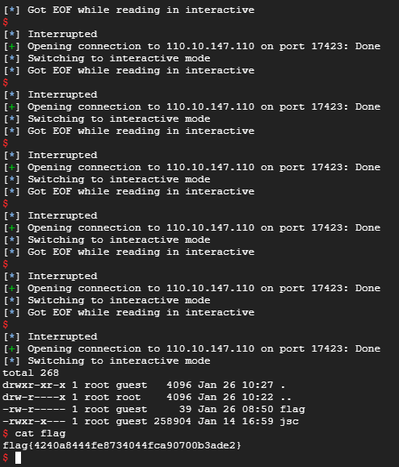

# Codegate CTF 2019 Preliminary Butterfree

Question:

```

Butterfree
Download 2018.11.18 Webkit and Modified 

nc 110.10.147.110 17423 

Download 

Download2


```

Writeup : Please refer to CVE-2016-4622 and 35c3 webkid for details

I can get the shell locally but I tired more than 200 times send the payload to remote service and get the flag in one of the attempt, not sure with the reason.



