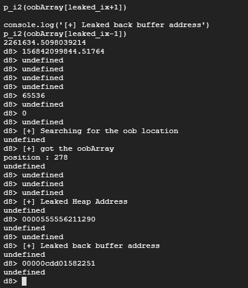
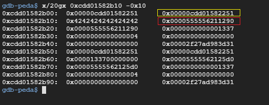
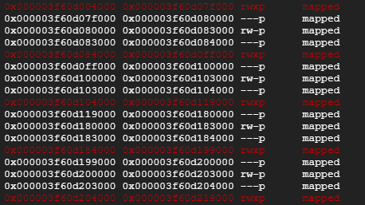

# PlaidCTF 2018 Roll-a-d8

From the question : 

```
This might only be helpful to Google employees... or is it? https://crbug.com/821137
```

We can search for the regression test under v8 's repo, but we need to slightly modify the test before really can trigger crashes

You have to modify the maxsize (increase) before triggering the crash on the d8 engine with the regression test 

After triggering the bug , we can leak the address of the array buffer with the help of the oobArray :


The buffer address is highlighted in red,while yellow box if pointed to oobArray :



vmmap:



# Reference and other exploits

1. https://pastebin.com/gtJA92j8

2. https://gist.github.com/sroettger/d077d3907999aaa0f89d11d956b438ea

3. https://gist.github.com/saelo/52985fe415ca576c94fc3f1975dbe837

4. https://gist.github.com/itszn/73cc299b9bcff1ed585e6206d1ade58e


