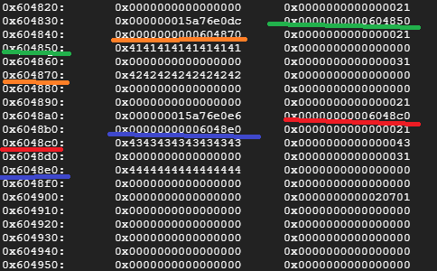
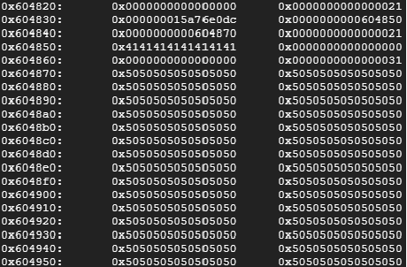
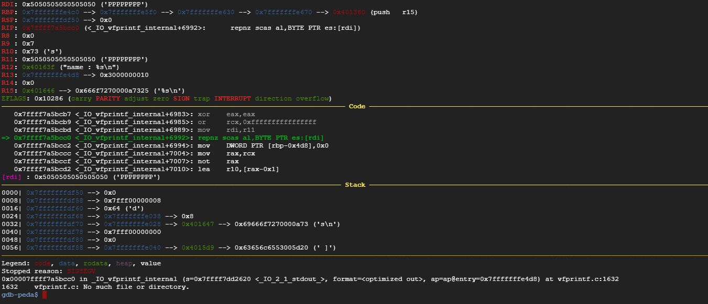

# Super Marimo - 375pts (Pwn)

題目:


>Super Marimo - 375pts (Pwn)
>
>nc ch41l3ng3s.codegate.kr 3333
>
>[Download](7ae39f9f3910ac6928dffc35a2b25548)


呢題點解值375, 其實我都晤太明 :/

可能係reverse個部份比較麻煩掛


menu:

```
[V]iew my bowls
[B]uy marimo
[S]ell marimo
[A]bout
[Q]uit
>> 

```


難點就係佢有個hidden menu, 要你打show me the marimo 先可以add marimo 上去

加marimo個陣,首先input maximum 0x10 做name, 0x20做profile

加完之後就可以去View到望下隻marimo


view :

```
[V]iew my bowls
[B]uy marimo
[S]ell marimo
[A]bout
[Q]uit
>> V
== Marimo's bowl List ==
[ bowl 0 ]
Select number or [B]ack
>> 0
birth : 1517739842
current time : 1517739851
size : 10
price : 50
name : AAAA
profile : BBBB
[M]odify / [B]ack ?
>> 

```

Bug就係呢到,個modifiy冇做bound checking ,搞到可以input >0x20 char 入profile, 引致heap overflow


望下個heapview先 (我已經加左(AAAA,BBBB),(CCCC,DDDD) marimo入去)





可以假設佢係類似嘅struct:

```C++

struct marimo {
    char *name;
    char *profile;
};


```

overflowed heap:




哈 又真係overflow到喎


view 1又會炒

GDB view:





# Exploit

只要我地有一個crafted "valid" heap structure ,fake 到edit 以為 char *profile  個個位支pointer 係一支"valid" pointer,就可以有arbitary write

咁可以write邊? puts->one_gadget_rce->get shell


solution: [solve.py](solve.py)


```
[*] Paused (press any to continue)
leaked libcbase =0x7f1cf459c000
leaked malloc =0x7f1cf4620130
leaked one =0x7f1cf45e1216
[*] Switching to interactive mode
$ ls
flag
marimo
$ cat flag
But_every_cat_is_more_cute_than_Marimo
$  

```
