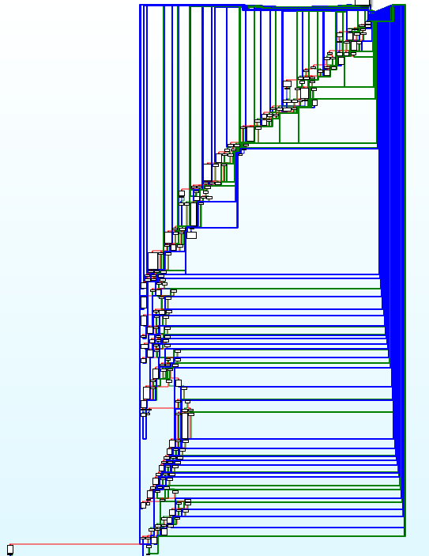
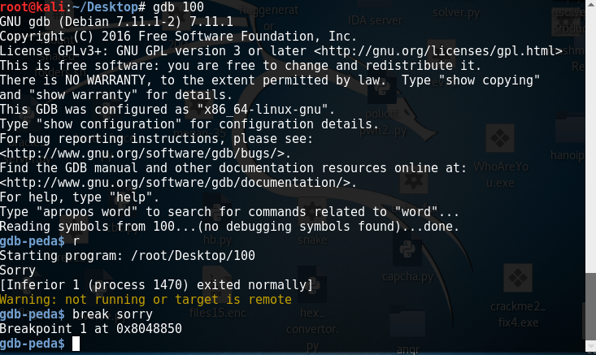
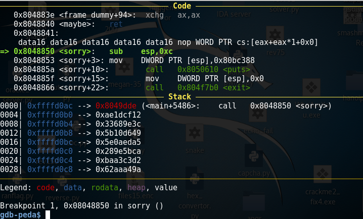
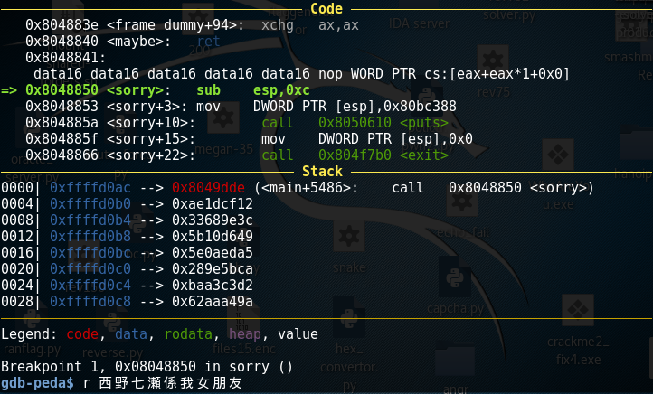
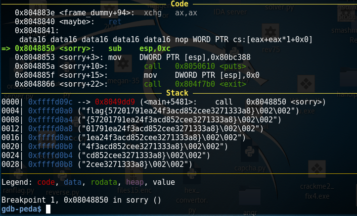

# SHA2017 CTF Rev100 Suspect File 1

**Description:**

>Suspect File 1 (100) - 63 solves
>
>We found some software on our suspects development server, it looks like they created some different versions, are you able to crack the >software?
>
>Challenge created by the Digital and Biometric Traces division of the Netherlands Forensic Institute.
> [suspectfile1.tgz](./suspectfile1.tgz)    220f680d2b441c43163065dc779a450b

# Writeup

第一次寫writeup,呢條只係sanity check,然而我用左個1鐘頭寫同debug angr script,再用左個半鐘頭 update angr :0)

首先Ida 左佢先



見到都反胃x_x

F5 code 
Conditions for output "Yes!"

```C++
.........
}
  while ( v10 != -915395067 );
  puts("Yes!");
  return 0;
}


```
由於冇scanf,估計要pass一個argv令v10==-915395067


gdb係sorry() set breakpoint



call sorry()之前嘅stack



pass左一個事實落去做argv



唔小心汁走左支flag ^_^



七瀨大法好


估計係因為中間太多while,所以angr爆炸,估計要z3解先得

唉 終於解到題~~~~~~~

