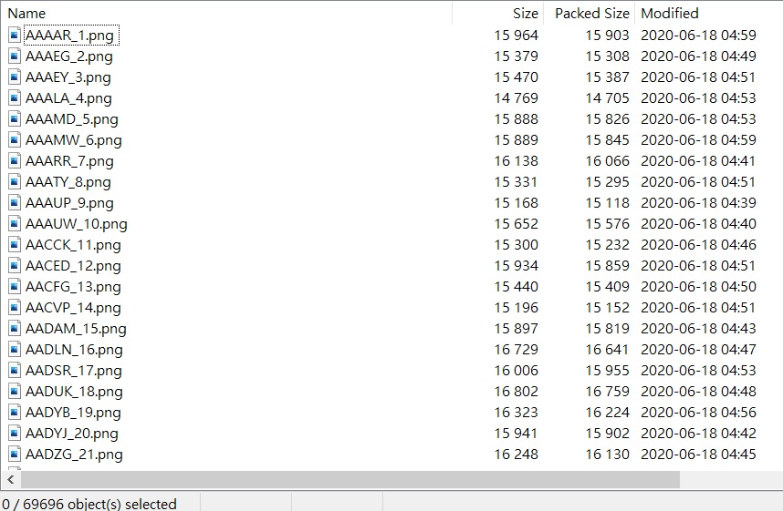
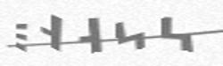

# UIUCTF 2020 Web 500 Bot Protection IV

Question : 

```
Challenge
4 Solves
Bot Protection IV
Point Value: 500
Challenge Description
When on website: +1 spam resistance +10 user annoyance

Gotta be fast! 500 in 10 minutes!

https://captcha.chal.uiuc.tf

Author: tow_nater

```


In this challenge, we have a website with captcha. Base on the question, we need to solve 500 captcha within 10 minutes. Very easy right? 


But the langauge of this captcha is the [Standard Galactic Alphabet](https://minecraft.gamepedia.com/Enchanting_Table#Standard_Galactic_Alphabet)(Minecraft glyphs)

The character mapping : 


From checking the source , we saw this comment : 


```html
<!--TODO: we don't need /captchas.zip anymore now that we dynamically create captchas. We should delete this file.-->
```

By visiting https://captcha.chal.uiuc.tf/captchas.zip, we can obtain ~70k samples provided by the challenge author 




Some of the examples : 


With this dataset, I think everyone can think of using Neural Network to solve this challenge (I guess Mnist or Captcha solving should be the first example you run in Deep Learning course right?)

From my experience, I know that it may not a good idea for me to debug/tune a neural network for doing computer vision work during a CTF, after some trial and error ,I come across with this excellent github repo [cnn_captcha](https://github.com/nickliqian/cnn_captcha). I also received a interactive script from my god like teammate [@samueltangz613](https://twitter.com/samueltangz613)

In order to use this code, you need to setup the config file (conf/sample_config.json) properly 

my config : 

```json
{
  "origin_image_dir": "/home/xxx/solve/captchas/",
  "new_image_dir": "/home/xxx/solve/new_train/",
  "train_image_dir": "/home/xxx/solve/train/",
  "test_image_dir": "/home/xxx/solve/test/",
  "api_image_dir": "sample/api/",
  "online_image_dir": "sample/online/",
  "local_image_dir": "sample/local/",
  "model_save_dir": "model_v8/",
  "image_width": 250,
  "image_height": 75,
  "max_captcha": 5,
  "image_suffix": "png",
  "char_set": "ABCDEFGHIJKLMNOPQRSTUVWXYZ",
  "use_labels_json_file": false,
  "remote_url": "http://127.0.0.1:6100/captcha/",
  "cycle_stop": 20000,
  "acc_stop": 0.99,
  "cycle_save": 500,
  "enable_gpu": 1,
  "train_batch_size": 32,
  "test_batch_size": 32
}


```

# First attempt 

With one GeForce RTX 2080, I can train up a model with 99% accuracy within 1.5 hours (Here, I didn't do a proper separate of train and test set, but turns out this model saved me a lot later....) 

This model mostly end up in lv30 to lv40 and start to fail. Anyway, it is normal. With a 99% accuracy, we only have 0.6570% to survive upto lv 500 :( 


# Second attempt 

Here, I think of [Ensemble Learning](https://en.wikipedia.org/wiki/Ensemble_learning). 


The idea of Ensemble Learning is very simple. Assume we trained multiple classifier for the same classification problem, we create a classification base on multiple classifier to our input. We apply a similar concept here, but we hope any one of them could solve the captcha even the previous model fails to do. Originally, we think of bruteforce the top 2 decision of each char, but turns out it requires 32 query , which we may run out of time ... 

To train up different models, I tried to play with the different parameters like batch size, size of evaluation set and different training set,etc. 

I also collected extra dataset by save those captcha we solved with only 1 model and denote as good set ,those with more than 2 models as benign set. We feed these data to our training script to train new model and deploy it to collect more new samples. In total, we collected 120k samples and trained 8 models through this iterating process. 

The strategy for adding new samples to the dataset as follows, we tried to extend our dataset upto about 90k with both good set and benign set. And the last 20k is from the benign set. We also trained several models with different numbers of data samples during our data collection procedures. 


The best result with 5 models : 


The best result with 8 models : 


For 5 models to 8 models ensemble , we improve from solving 40 level before fail to average solving 60 level. However, it still very far away from solving 500 within 10 minutes.

At the end, my god like teammate [@samueltangz613](https://twitter.com/samueltangz613) come up with an idea to solve as a hybird approach (DL model + human)...

If a captcha can't be solve with 8 of my models, it will solve by myself .... 

After 3 trials(once timeout at 495 lv, once at 365 lv), we succesfully capture the flag with ~90 second left by luck (manually solved ~10 times in total).... 


```python

Level 497 is not high enough
Invalid captcha
Invalid captcha
Invalid captcha
Invalid captcha
Invalid captcha
Level 498 is not high enough
Level 499 is not high enough
uiuctf{i_knew_a_guy_in_highschool_that_could_read_this}
Traceback (most recent call last):
  File "man.py", line 168, in <module>
    main()
  File "man.py", line 159, in main
    lv = int(header.split(" ")[1])
IndexError: list index out of range

```

```
Flag : uiuctf{i_knew_a_guy_in_highschool_that_could_read_this}
```

Since the model file(~500 MB), and extended dataset (~2GB) are too large, I will not upload here, however everything can reproduce easily if author release the captcha generator or made one by yourself base on the font ... 

# Credit 

90 % of work from [@samueltangz613](https://twitter.com/samueltangz613) , 10 % from me 


# Reflection 

I guess there are better way to solve it with full automation right ? 

After submitted the flag, I tried to do cause analysis why is such hard to solve with full automation (I know that I am too weak , don't laugh at me plz T_T)

I got some observation 

1. Continuous duplicate character is hard to solve with my model , 

JGGSS :



YJKYY :


2. J,R,P,Y seems pretty hard to recognize due to similar shape to other characters or is formed by more than 2 components... ... 

YJKYY :


JPSCB :


FDSEJ : 


VJGJJ : 


3. In fact ,most of cases I solve manually the edit distance is between 1-2 characters and the problematic region are share by different models... 

For example PTJYZ : 


Option available : 


T⍑ᔑリꖌᓭ ⎓𝙹∷ ∷ᒷᔑ↸╎リ⊣ ⚍リℸ ̣ ╎ꖎ ⍑ᒷ∷ᒷ :) 

